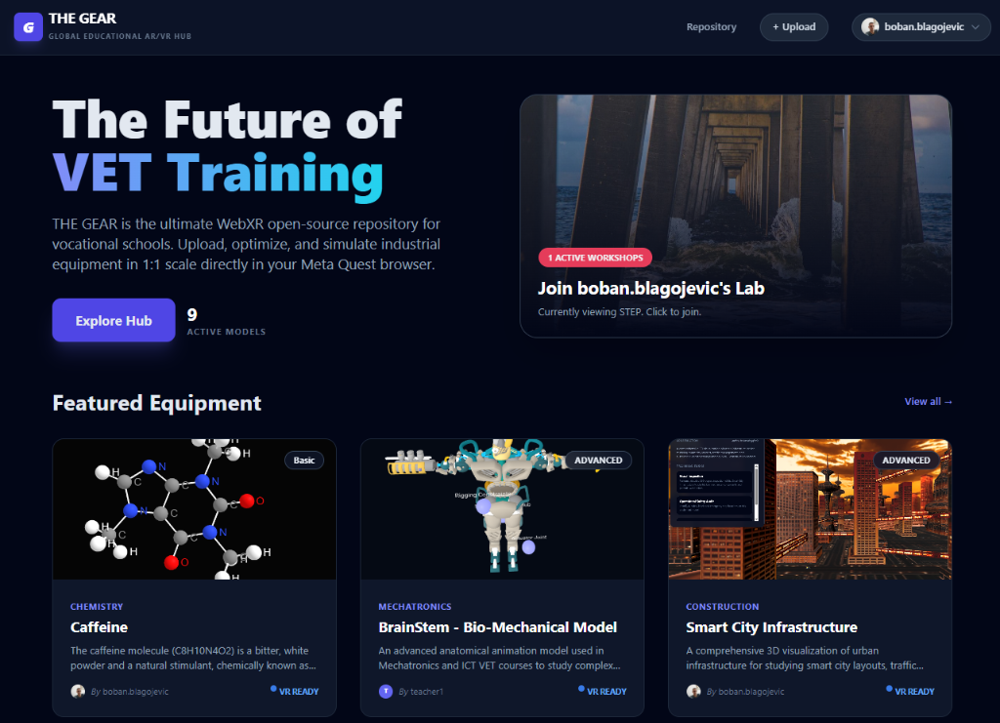

# THE GEAR - VET WebXR Hub

**THE GEAR** is an open-source WebXR platform designed for Vocational Education and Training (VET). It allows schools and students to upload, manage, and interact with 3D digital twins of industrial equipment directly in the browser, with support for VR headsets (Meta Quest), mobile devices, and desktops.

[](https://gear.tsp.edu.rs)

### 🌐 [Live Demo: gear.tsp.edu.rs](https://gear.tsp.edu.rs)

## 🚀 Key Features

*   **3D Asset Repository**: Upload and manage `.glb`, `.gltf`, `.obj`, and `.stl` models.
*   **WebXR Viewer**: Interactive VR/AR visualization using A-Frame and Three.js.
*   **Molecular Viewer**: Dedicated PDB viewer for chemistry and biology molecules.
*   **CAD Support**: Dedicated kernel-based viewer for `.stp` / `.step` industrial files (powered by OpenCascade.js).
*   **Smart Uploads**: Support for **.ZIP** archives with automatic extraction and detection of main CAD assembly files (`.step`, `.sldasm`, etc.).
*   **Dynamic Sectors**: Flexible categorization system that adapts as users upload content from different fields.
*   **Interactive Lessons**: Create and take guided 3D lessons with step-by-step instructions (Markdown) linked to specific CAD/VR models.
*   **AI Mentor**: Voice-activated AI assistant (Gemini 2.0 Flash) for context-aware guidance.
*   **Multi-User Workshops**: Shared virtual spaces with real-time position synchronization and collaborative interactions.
*   **Dashboard**: Featured models, category-based filtering (sectors), and **My Models** personalized view.
*   **Mixed Reality Mode**: Immersive AR experience with Passthrough, Hand Tracking, and Spatial UI controls.
*   **User Management System**: Three-tier Role-Based Access Control (Admin, Teacher, Student) with profile customization.
*   **Help Center**: Dedicated support page with interactive **System Diagnostics** (WebXR/HTTPS checks) and tutorials.
*   **Contextual Onboarding**: Interactive guided tour for new users and inline tooltips for complex forms.

## 📚 Interactive Lessons (New in v1.4)
 
 Teachers can now create structured educational content directly within the platform:
 *   **Split-Screen Interface**: Instructions on the left, interactive 3D model on the right.
 *   **Rich Text Editor (WYSIWYG)**: Format content easily with Bold, Italic, Headers, Lists, and Code blocks without knowing Markdown.
 *   **Step Media**: Add specific images to each step (displayed in sidebar or fullscreen if no model is present).
 *   **Smart Paste**: Paste images (`Ctrl+V`) directly into the editor to automatically upload and insert them.
 *   **Model Linking**: Associate different 3D models with specific steps (e.g., show the whole engine in Step 1, piston in Step 2).
 *   **Responsive Viewer**: Optimized experience for mobile devices with collapsible sidebar.
 *   **My Lessons**: Personal dashboard for managing created content.

## 🎓 Gamification & Progress Tracking (New in v1.5)

To increase student engagement, lessons now support interactive challenges:
*   **Quizzes**: Embed multiple-choice questions within regular lesson flow. Instant feedback validates understanding.
*   **Find-the-Part**: Task students with locating specific components on the 3D model (e.g., "Find the Safety Valve"). Requires clicking the correct mesh to proceed.
*   **Teacher Dashboard**: Dedicated analytics view for teachers to monitor who has started or completed their lessons.
*   **Progress Tracking**: Automatic recording of lesson attempts, including last step reached and completion timestamps.

## 📱 PWA & Offline Support (New in v1.6)

THE GEAR is now a fully functional **Progressive Web App (PWA)**:
*   **Installable**: Add to Home Screen on iOS/Android or install as a desktop app via Chrome/Edge for a native-like experience.
*   **Offline Access**: The application shell and visited content (models, lessons) are automatically cached. You can continue learning even without an internet connection.
*   **Performance**: Faster load times thanks to Service Worker caching strategies.

## 🥽 Mixed Reality Features (v1.2 Update)

The PDB Viewer now supports advanced WebXR capabilities on compatible devices (e.g., Meta Quest 2/3/Pro):

*   **AR Passthrough**: See the real world behind the molecule.
*   **Hand Tracking**: Put down your controllers to use your bare hands.
    *   **Pinch** to **Grab & Move** the molecule.
    *   **Pinch** to Click buttons on the 3D Menu.
*   **Controller Support**:
    *   **Grab (Trigger/Grip)**: Move and rotate the molecule.
    *   **Thumbstick Up/Down**: Scale the molecule (Zoom In/Out).
*   **Spatial UI**: A floating 3D menu anchored in the real world.
*   **Visualization Styles**: Switch instantly between **Ball & Stick**, **Spacefill**, and **Backbone** views.
*   **Realism**: Dynamic shadows ground the virtual molecule in your physical space.
*   **Two-Handed Interaction (v1.2.1)**:
    *   **Pinch-to-Zoom**: Use both hands to intuitively scale the molecule.
    *   **Two-Handed Rotation**: Rotate the molecule by moving your hands relative to each other.

## 👥 Roles & Permissions

The platform implements a strict Role-Based Access Control (RBAC) system:

| Feature | Student | Teacher | Admin |
| :--- | :---: | :---: | :---: |
| **View Models** | ✅ | ✅ | ✅ |
| **Enter VR/AR** | ✅ | ✅ | ✅ |
| **Upload Models** | ✅ | ✅ | ✅ |
| **Edit Own Models** | ✅ | ✅ | ✅ |
| **Delete Own Models** | ✅ | ✅ | ✅ |
| **Edit/Delete ANY Model** | ❌ | ❌ | ✅ |
| **Feature Models** | ❌ | ❌ | ✅ |
| **Manage Users** | ❌ | ❌ | ✅ |
| **Create Workshops** | ✅ | ✅ | ✅ |

## 🛠 Tech Stack

### Frontend
*   **React 19** (Vite)
*   **TypeScript**
*   **TailwindCSS** (Styling)
*   **A-Frame** (WebXR Framework)
*   **Three.js** (3D Rendering)
*   **OpenCascade.js** (CAD Kernel)
*   **Socket.io-client** (Real-time)

### Backend
*   **Node.js / Express**
*   **MariaDB / MySQL** (Database)
*   **Socket.io** (WebSocket Server)
*   **Multer** (File Uploads)
*   **Adm-Zip** (Archive Processing)
*   **Google Gemini API** (AI Features)

---

## 💻 Local Initialization

### 1. Prerequisites
*   Node.js (v18+)
*   MariaDB or MySQL Server

### 2. Installation
```bash
# Clone the repository
git clone https://github.com/blagojevicboban/GEAR.git
cd GEAR

# Install dependencies
npm install
```

### 3. Database Setup
1.  Create a MySQL/MariaDB database named `gear`.
2.  **Option A: Developer Quick Start (Recommended)**
    Reset and seed the database with standard tables and sample data:
    ```bash
    npm run seed
    ```
    *Note: This command clears existing data in the `gear` database.*

3.  **Option B: Manual / Production Setup**
    *   **Initialize Schema**:
        ```bash
        mysql -u gear -p gear < scripts/gear_full_dump.sql
        ```
    *   **Apply Migrations** (Critical for updates):
        ```bash
        mysql -u gear -p gear < scripts/migration_add_featured.sql
        mysql -u gear -p gear < scripts/migration_add_workshops.sql
        ```

### 4. Environment Configuration
Create a `.env` file in the root directory:
```env
DB_HOST=localhost
DB_USER=gear
DB_PASSWORD=your_password
DB_NAME=gear
API_KEY=your_google_gemini_api_key
```

### 5. Running Locally
```bash
# Start Development Server (Frontend + Backend concurrently)
npm run dev
```
*   **Vite Frontend (Proxy)**: `http://localhost:3000`
*   **Backend API**: `http://localhost:3001`

### Default Admin Credentials
If you used `npm run seed`, a default admin account is available:
*   **Email**: `boban@example.com`
*   **Password**: `admin123`

To run in production mode (serving built files):
```bash
npm run build
npm run start
```
*   **App**: `http://localhost:3001`

---

## 🌍 Deployment (Production)

### Server Requirements
*   Linux Server (Ubuntu/Debian recommended)
*   Node.js & NPM
*   PM2 (Process Manager)
*   Nginx (Web Server / Proxy)
*   MariaDB/MySQL


### Deployment Scripts
*   `deployment/deploy.sh`: Basic script used by the webhook for local build and restart.
*   `scripts/deploy_full.sh`: Full automated deployment utility (Database Sync + Uploads + SSH Trigger).

### Manual Deployment Steps
1.  **Pull Code**:
    ```bash
    cd /path/to/app
    git pull origin main
    npm install
    npm run build
    ```

2.  **Database Migration**:
    Ensure valid database structure.
    ```bash
    mariadb -u gear -p gear < scripts/migration_add_featured.sql
    mariadb -u gear -p gear < scripts/migration_add_workshops.sql
    ```

3.  **Start Services**:
    ```bash
    pm2 start server/index.js --name gear-backend
    pm2 start deployment/webhook.js --name gear-webhook
    pm2 save
    ```

### 🔄 Automated Deployment (CI/CD)
The project includes a built-in Webhook listener (`deployment/webhook.js`) running on port `9000`. 
When a `push` event is received from GitHub/GitLab:
1.  The webhook triggers `deployment/deploy.sh`.
2.  It pulls the latest code (`git pull`).
3.  Installs dependencies and rebuilds the frontend.
4.  **Restarts the Backend** (`pm2 restart gear-backend`) to apply changes.

**To enable this:**
1.  Configure a Webhook in your GitHub Repo Settings pointing to `http://your-server-ip:9000`.
2.  Ensure `gear-webhook` is running via PM2.

### 🔧 Nginx Configuration (Critical)
The application assumes it is running behind a proxy. Ensure your Nginx config proxies `/api` requests to the Node.js backend (default port 3001).

**Important**: The application uses `/api/uploads` to serve static assets on production to avoid Nginx 404 errors for direct file access.

```nginx
location /api/ {
    proxy_pass http://localhost:3001;
    proxy_http_version 1.1;
    proxy_set_header Upgrade $http_upgrade;
    proxy_set_header Connection 'upgrade';
    proxy_set_header Host $host;
    proxy_cache_bypass $http_upgrade;
}

# Socket.io support
location /socket.io/ {
    proxy_pass http://localhost:3001;
    proxy_http_version 1.1;
    proxy_set_header Upgrade $http_upgrade;
    proxy_set_header Connection "Upgrade";
    proxy_set_header Host $host;
}
```

### Option B: Apache / Virtualmin Configuration
If you are using Apache (common with Virtualmin), use `ProxyPass` and `RewriteRule` for WebSocket support.

```apache
<VirtualHost *:80>
    ServerName gear.tsp.edu.rs
    DocumentRoot /home/gear/public_html/dist

    <Directory /home/gear/public_html/dist>
        Options -Indexes +FollowSymLinks
        AllowOverride All
        Require all granted
        RewriteEngine On
        RewriteCond %{REQUEST_FILENAME} !-f
        RewriteCond %{REQUEST_FILENAME} !-d
        RewriteRule . /index.html [L]
    </Directory>

    # Proxy API
    ProxyPass /api http://localhost:3001/api
    ProxyPassReverse /api http://localhost:3001/api

    # Proxy Webhook (CI/CD)
    ProxyPass /webhook http://localhost:9000
    ProxyPassReverse /webhook http://localhost:9000

    # Proxy Socket.io (WebSocket + Polling)
    RewriteEngine On
    RewriteCond %{REQUEST_URI}  ^/socket.io            [NC]
    RewriteCond %{QUERY_STRING} transport=websocket    [NC]
    RewriteRule /(.*)           ws://localhost:3001/socket.io/$1 [P,L]

    ProxyPass        /socket.io http://localhost:3001/socket.io
    ProxyPassReverse /socket.io http://localhost:3001/socket.io
</VirtualHost>
```

---

## 🐛 Troubleshooting

### "Failed to load resource" (Images/Models 404)
*   **Cause**: Nginx is trying to serve `/uploads/...` from the React `dist` folder instead of the backend.
*   **Fix**: The code automatically rewrites URLs to `/api/uploads/...`. Ensure your backend is running and Nginx is correctly proxying `/api` to `localhost:3001`.

### Database Connection Error
*   Check `.env` file credentials.
*   Ensure MariaDB service is running (`systemctl status mariadb`).

### Socket.io / Workshop Connection Issues
*   **Symptoms**: Cannot join workshops or see other users.
*   **Fix**: Ensure Nginx is proxying `/socket.io/` with the correct `Upgrade` and `Connection` headers as shown in the Nginx Configuration section.

### 500 Error on Upload
*   **Cause**: Missing database columns.
*   **Fix**: Run `scripts/migration_add_featured.sql` to add `isFeatured` column.

### Server Errors (500)
*   The backend logs detailed errors to `server_error.log` in the project root. Check this file for stack traces if API requests fail.

---

## 🤝 Contributing
1.  Fork the Project
2.  Create your Feature Branch (`git checkout -b feature/AmazingFeature`)
3.  Commit your Changes (`git commit -m 'Add some AmazingFeature'`)
4.  Push to the Branch (`git push origin feature/AmazingFeature`)
5.  Open a Pull Request

See [CONTRIBUTING.md](CONTRIBUTING.md) for detailed guidelines.

## 📖 Documentation

*   [API Reference](docs/API.md): Detailed documentation of backend endpoints.
*   [Developer Guide](CONTRIBUTING.md): Setup, testing, and architecture.
